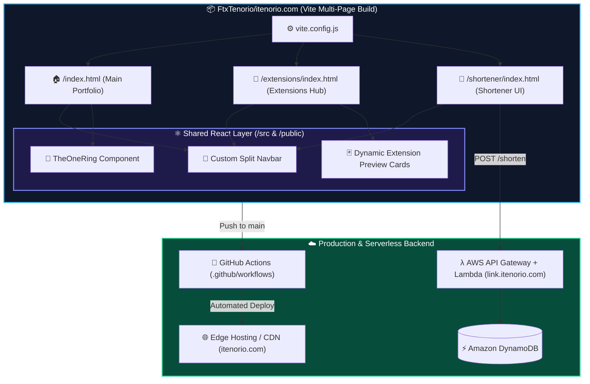

<div align="center">
 
  <!-- ================= HERO BANNER (VENOM NEON) ================= -->
   

  <!-- ================= TYPING SVG ================= -->
  <a href="https://itenorio.com">
    
  </a>

  <br/>

  <!-- ================= STATUS & TECH BADGES ================= -->
  <p align="center">
    <a href="https://itenorio.com" target="_blank">
      
    </a>
    
  </p>

  <!-- ================= QUICK NAVIGATION PILLS ================= -->
  <p align="center">
    <a href="https://itenorio.com" target="_blank">
      
    </a>
    <a href="https://itenorio.com/extensions" target="_blank">
      
    </a>
    <a href="https://itenorio.com/shortener" target="_blank">
      
    </a>
  </p>

</div>

---

### ⚡ What is `itenorio.com`?

Instead of shipping a generic single-page resume, **`itenorio.com`** was engineered as a **multi-entry React + Vite application** that serves as my personal software consultancy hub (**iTenorio Tech** 🏴󠁧󠁢󠁥󠁮󠁧󠁿), a live showcase for my published browser extensions, and a functional web client for my serverless utilities.

<table align="center" width="100%">
  <tr>
    <td width="55%" valign="top">
      <h4>🔥 Core Highlights</h4>
      <ul>
        <li><b>Multi-Page Vite Architecture:</b> Custom <code>vite.config.js</code> splitting independent entry points (<code>/</code>, <code>/extensions</code>, and <code>/shortener</code>) while sharing core UI components and navigation.</li>
        <li><b>Dynamic Extension Preview Cards:</b> Interactive showcase rendering live metadata, previews, and store links for my browser tools (such as <i>Crunchy Navigator</i>).</li>
        <li><b>Serverless Link Shortener Client:</b> Dedicated <code>/shortener</code> route integrated with my AWS Serverless backend (Lambda + API Gateway + DynamoDB) to mint short links under <code>link.itenorio.com</code>.</li>
        <li><b>Interactive UI & Easter Eggs:</b> Custom animations, responsive raw/split Navbar layouts, and the legendary <code>&lt;TheOneRing /&gt;</code> component integrated right into the app 💍.</li>
      </ul>
    </td>
    <td width="45%" valign="top">
      <h4 align="center">🛠️ Built With</h4>
      <div align="center">
        <br/>
        
        <br/><br/>
      </div>
      <pre lang="diff">
+ Multi-Page Rollup Bundling (Vite)
+ Automated CI/CD via GitHub Actions
+ Zero-bloat Fast Refresh & ESLint
+ Interactive 3D/Visual Easter Eggs</pre>
    </td>
  </tr>
</table>

---

### 🖥️ Live Ecosystem & Route Previews

> 💡 *Click any card below to jump straight into the live route in production:*

<table align="center" width="100%">
  <tr>
    <td width="33%" align="center" valign="top">
      <h4>🏠 1. Main Engineering Hub</h4>
      <a href="https://itenorio.com" target="_blank">
        <!-- DICA: Se quiser usar um print local da pasta public, troque o src abaixo por "./public/nome-da-imagem.png" -->
        
      </a>
      <p align="left">
        <b>Route:</b> <code><a href="https://itenorio.com">itenorio.com/</a></code><br/>
        Interactive portfolio, consultancy overview, career timeline, and the integrated <code>TheOneRing</code> visual component.
      </p>
    </td>
    <td width="33%" align="center" valign="top">
      <h4>🧩 2. Extensions Hub</h4>
      <a href="https://itenorio.com/extensions" target="_blank">
        <!-- DICA: Você pode trocar o src abaixo pela imagem da extensão na sua pasta public/ ou src/ -->
        
      </a>
      <p align="left">
        <b>Route:</b> <code><a href="https://itenorio.com/extensions">/extensions</a></code><br/>
        Dedicated showcase featuring dynamic extension preview cards, enhanced layouts, and direct Chrome Web Store integrations.
      </p>
    </td>
    <td width="33%" align="center" valign="top">
      <h4>🔗 3. URL Shortener App</h4>
      <a href="https://itenorio.com/shortener" target="_blank">
        <!-- DICA: Você pode trocar o src abaixo por um print do shortener da sua pasta public/ -->
        
      </a>
      <p align="left">
        <b>Route:</b> <code><a href="https://itenorio.com/shortener">/shortener</a></code><br/>
        Sleek frontend interface for creating instant, low-latency short URLs powered by AWS Lambda & DynamoDB.
      </p>
    </td>
  </tr>
</table>

---

### 🧠 System Architecture & Routing Flow

> *How a single repository powers the portfolio, the extensions catalog, and the serverless shortener interface:*



---

### 📂 Repository Anatomy

```text
[itenorio.com/](https://itenorio.com/)
├── .github/workflows/   # 🚀 Automated CI/CD pipelines & build output workflows
├── extensions/          # 🧩 Entry point & routing setup for [itenorio.com/extensions](https://itenorio.com/extensions)
├── public/              # 🎨 Static assets, icons & 3D/visual artifacts (TheOneRing)
├── shortener/           # 🔗 Entry point & logic for [itenorio.com/shortener](https://itenorio.com/shortener)
├── src/                 # ⚛️ Core React components, Navbar, TheOneRing & Dynamic Preview Cards
├── index.html           # 🏠 Main portfolio entry point
├── vite.config.js       # ⚡ Multi-page Vite bundler & route configuration
├── eslint.config.js     # 🔍 Code quality & linting rules
└── package.json         # 📦 Dependencies & build scripts
```

---

### 🚀 Running Locally in 30 Seconds

<div align="center">
  
</div>

```bash
# 1. Clone the repository
git clone [https://github.com/FtxTenorio/itenorio.com.git](https://github.com/FtxTenorio/itenorio.com.git)
cd itenorio.com

# 2. Install dependencies
npm install

# 3. Spin up the Vite development server with HMR
npm run dev

# 4. Build optimized multi-page bundle for production
npm run build
```

---

### 🕵️‍♂️ Secret Lore *(Click to expand)*

<details>
  <summary><b>💍 What is <code>TheOneRing</code> doing in a software engineer's portfolio?</b></summary>
  <br/>
  <blockquote>
    <i>"One Ring to rule them all, One Ring to find them, One Ring to bring them all and in the darkness bind them."</i>
  </blockquote>
  <p>
    Because a personal website shouldn't look like a boring corporate spreadsheet. I built and integrated the <b><code>TheOneRing</code></b> component inside <code>src/</code> & <code>public/</code> to give the main landing page a unique interactive centerpiece. Check it out live at <a href="https://itenorio.com">itenorio.com</a>!
  </p>
</details>

---

<div align="center">
  

  <details>
    <summary><sub>⚡</sub></summary>
    <sub>Crafted with ☕ in England 🏴󠁧󠁢󠁥󠁮󠁧󠁿 · Rooted in Brazil 🇧🇷</sub>
  </details>
</div>
